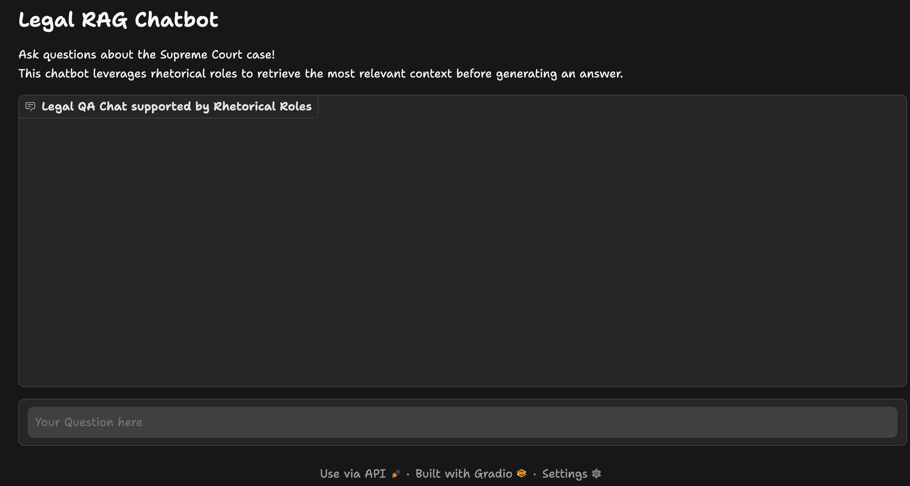

# LegalAI_and_LLMs
Playground to explore LLMs in the context of legal AI and document understanding

The aim is to build general solutions that utilize LLMs for specific niches. I had to choose one, I pick legal/law (see my previous work in legal AI https://www.datascienceportfol.io/purbid)

This repo can grow to include RAGs, distilled models and agentic frameworks. So keeping this readme loose ended right now

